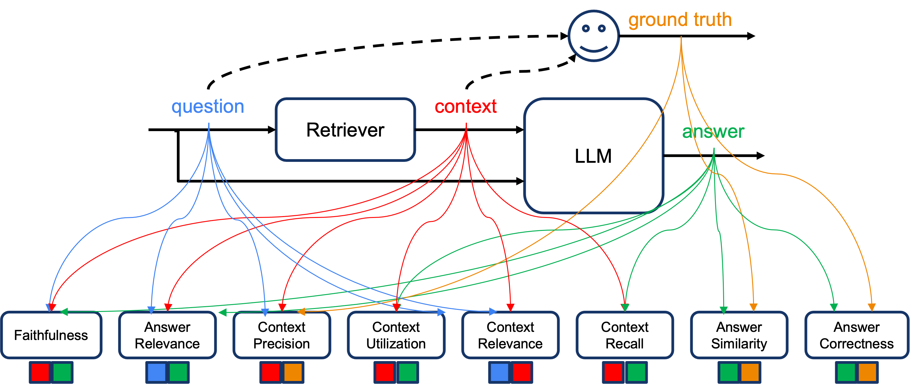
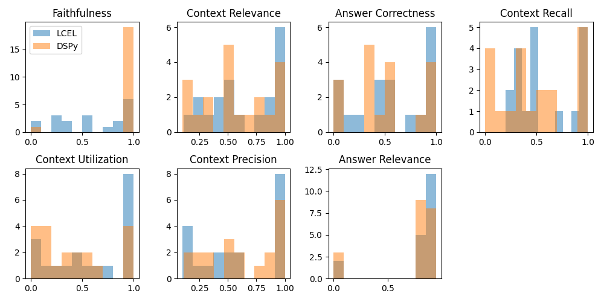

# llm-rag-eval

Large Language Model (LLM) powered evaluator for Retrieval Augmented Generation (RAG) pipelines.



## Google AI Hackathon Submission

[Submission Video Link](https://youtu.be/yOIU65chc98)

### Inspiration

Our project is inspired by the [RAGAS](https://github.com/explodinggradients/ragas) project which defines and implements 8 metrics to evaluate inputs and outputs of a Retrieval Augmented Generation (RAG) pipeline, and by ideas from the [ARES paper](https://arxiv.org/abs/2311.09476), which attempts to calibrate these LLM evaluators against human evaluators.

### What it does

It allows users to build evaluation metrics for their RAG systems that are optimized for their domain.

### How we built it

1. We re-implemented the RAGAS metrics using [LangChain Expression Language (LCEL)](https://python.langchain.com/docs/expression_language/) so we could access outputs of intermediate steps in metrics calculation.
2. We then implemented the metrics using [DSPy (Declarative Self-improving Language Programs in Python)](https://github.com/stanfordnlp/dspy) and optimized the prompts to minimize score difference with LCEL using a subset of examples for Few Shot Learning (using Bootstrap Few Shot with Random Search).
3. We evaluated the confidence of scores produced by LCEL and DSPy metric implementations.
4. We are building a tool that allows human oversight on the LCEL outputs (including intermediate steps) for Active Learning supervision.
5. We will re-optimize the DSPy metrics using recalculated scores based on tool updates.

### Challenges we ran into

* DSPy has a steep learning curve and it is still a work in progress, so some parts of it don't work as expected
* Our project grew iteratively as our understanding of the problem space grew, so we had to do some steps sequentially, leading to wasted time

### Accomplishments that we're proud of

* How team members from different parts of the world came together and pooled their skills towards our common goal of building a set of domain optimized metrics.

### What we learned

* We gained greater insight into the RAGAS metrics once we implemented them ourselves. We gained additional insight when building the tool using the intermediate outputs.
* Our team was not familiar with DSPy at all, we learned to use it and are very impressed with its capabilities

### What's next for llm-rag-eval

We notice that most of our metrics involve predictive steps, where we predict a binary outcome given a pair of strings. These seem like variants of NLI (Natural Language Inference) which could be handled by non-LLM models, which are not only cheaper but also don't suffer from hallucinations, leading to more repeatable evaluations. It will require more data to train them, so we are starting to generate synthetic data, but this has other dependencies before we can start to offload these steps to smaller models.


## Running Prompted RAGAS metrics

The following RAGAS metrics have been (re-)implemented in this project (because
I had trouble making them work as-is, and because they are conceptually quite 
simple to implement).

* [Faithfulness](https://docs.ragas.io/en/stable/concepts/metrics/faithfulness.html) -- given question, context and answer, measures factual consistency of the answer against the given context.
* [Answer Relevance](https://docs.ragas.io/en/stable/concepts/metrics/answer_relevance.html) -- given question, context and answer, measures how pertinent the answer is to the question.
* [Context Precision](https://docs.ragas.io/en/stable/concepts/metrics/context_precision.html) -- given question, context and ground truth, measures whether statements in the ground truth are found in context.
* Context Utilization -- same as Context Precision, using the predicted answer instead of the ground truth.
* [Context Relevance](https://docs.ragas.io/en/stable/concepts/metrics/context_relevancy.html) -- given question and context, measures relevance of the context against the question.
* [Context Recall](https://docs.ragas.io/en/stable/concepts/metrics/context_recall.html) -- given the context and answer, measures extent to which context aligns with the answer.
* [Answer Similarity](https://docs.ragas.io/en/stable/concepts/metrics/semantic_similarity.html) -- given answer and ground truth, measures semantic similarity between them (cosine or cross encoder similarity).
* [Answer Correctness](https://docs.ragas.io/en/stable/concepts/metrics/answer_correctness.html) -- given answer and ground truth, measures the accuracy given facts in these two texts.

The metrics described above can be run against your dataset by calling the `run_prompted_metrics.py` script in the `src` directory, with the path to the input (provided in JSON-L), the path to the output (TSV) file, and the appropriate metric name.

```
$ python3 run_prompted_metrics.py --help
usage: run_prompted_metrics.py [-h] --metric
                               {answer_correctness,answer_relevance,answer_similarity,context_precision,context_recall,context_relevance,context_utilization,faithfulness}
                               --input INPUT_JSONL [--output OUTPUT_TSV] [--parallel] [--cross-encoder]

options:
  -h, --help            show this help message and exit
  --metric {answer_correctness,answer_relevance,answer_similarity,context_precision,context_recall,context_relevance,context_utilization,faithfulness}
                        The metric to compute
  --input INPUT_JSONL
                        Full path to evaluation data in JSONL format
  --output OUTPUT_TSV
                        Full path to output TSV file
  --parallel            Run in parallel where possible (default false)
  --cross-encoder       Use cross-encoder similarity scoring (default false)
```

Ideally, we want to generate metrics from a running RAG pipeline, but in order to simplify the development process, we have isolate the evaluation functionality, feeding it the input it needs via a JSON-L file. Each line of the JSON-L file represents a single RAG transaction. The required fields are as follows.

```
{
    "id": {qid: int},
    "query": {query: str},
    "context": [
        {
            "id": {chunk_id: str},
            "chunk_text": {chunk_text: str},
            ... other relevant fields
        },
        ... more context elements
    ],
    "ideal_answer": {ground_truth: str},
    "predicted_answer": {answer: str}
}
```

We have used the [AmnestyQA](https://huggingface.co/datasets/explodinggradients/amnesty_qa) dataset on HuggingFace as our reference dataset. You can find a copy of that data in the format described above.

## Running Learned RAGAS metrics

We have used DSPy to optimize our prompts for AmnestyQA dataset. At a very high level, this involves using random subsets of the training data (in our case outputs from our prompted RAG metrics) and finding the best subset of examples that produce the most optimized prompt.

The DSPy implementations look for the optimized configuration in `resource/configs`. If it doesn't find it, then it looks for the dataset to allow it to optimize itself first. We have provided configurations for RAGAS metrics prompts optimized for AmnestyQA, but you probably need to generate optimized versions for your own dataset. To do so, you need to run the `generate_datasets.py` script, which will extract data from running the RAGAS prompts against the LLM and write it out as a JSON file into `data/dspy-datasets` (that's where the DSPy fine-tuning code expects to find it). The command to generate a dataset to fine-tune a DSPy prompt for a particular metric is shown below:

```
$ python3 generate_datasets.py --help
usage: generate_datasets.py [-h] --metric
                            {answer_correctness,answer_relevance,answer_similarity,context_precision,context_recall,context_relevance,context_utilization,faithfulness}
                            --input INPUT --output OUTPUT [--parallel] [--debug]

options:
  -h, --help            show this help message and exit
  --metric {answer_correctness,answer_relevance,answer_similarity,context_precision,context_recall,context_relevance,context_utilization,faithfulness}
                        The metric to generate datasets for
  --input INPUT         Full path to input JSONL file
  --output OUTPUT       Full path to output directory
  --parallel            Run in parallel where possible (default false)
  --debug               Turn debugging on (default: false)
```

To re-run the optimization locally, remove the configuration file for the metric from the `resources/config` directory. The next time you run `run_learned_metrics.py` it will re-optimize (this is a fairly lengthy process but doesn't require GPU). Leave the config file alone to re-use the prompt optimized for AmnestyQA.

```
$ python3 run_learned_metrics.py --help
usage: run_learned_metrics.py [-h] --metric
                              {answer_correctness,answer_relevance,answer_similarity,context_precision,context_recall,context_relevance,context_utilization,faithfulness}
                              --input INPUT [--output OUTPUT] [--cross-encoder] [--model-temp MODEL_TEMP]

options:
  -h, --help            show this help message and exit
  --metric {answer_correctness,answer_relevance,answer_similarity,context_precision,context_recall,context_relevance,context_utilization,faithfulness}
                        The metric to compute
  --input INPUT         Full path to evaluation data in JSONL format
  --output OUTPUT       Full path to output TSV file
  --cross-encoder       Use cross-encoder similarity scoring (default true)
  --model-temp MODEL_TEMP
                        The temperature of the model - between 0.0 and 1.0 (default 0.0)
```

## Comparing Prompted vs Learned Metrics

After computing the different metrics using the "prompted" approach using LCEL and the "optimized from data" approach using DSPy, we plot the scores as shown below.



Visually, at least for some of the metrics, the DSPy approach seems to produce scores whose histograms are narrower around 0 and 1. In order to quantify this intuition, we measure deviations of the scores from 0.5 on the upper and lower side, then compute the standard deviation of the deviations for both LCEL and DSPy scores for each metric. The results are summarized below.

| Metric | LCEL | DSPy |
|--------|------|------|
| Faithfulness | 0.162 | **0.000** |
| Context Relevance | 0.191 | **0.184** |
| Answer Correctness | 0.194 | **0.193** |
| Context Recall | 0.191 | **0.183** |
| Context Utilization | **0.186** | 0.189 |
| Context Precision | 0.191 | **0.178** |
| Answer Relevance | **0.049** | 0.064 |

As can be seen, for most of the metrics, optimized prompts from DSPy produce more confident scores. In many cases, the difference is quite small, which may be attributed to the relatively few examples we are working with.

## Synthetic QA Dataset Creation

One of the more difficult aspects of many ML challenges is the limited availability of curated datasets, particularly QA datasets.  

For this reason, we developed a technique, using Gemini Pro, to create synthetic QA datasets from existing QA datasets, instructing the LLM what to do and providing examples of specific answers to questions.  With those examples, the LLM is able to create entirely new questions, propose answers, and provide one of more snippets of context for each question and answer pair.  

These new QA datasets can then be used as input to the evaluation workflow.  

Command-line switches allow a fair amount of flexibility in the output, such as ID numbering, how many output questions to create from each input question, and the total # of questions to create.

```
python3 ./make_more_questions.py --help
usage: make_more_questions.py [-h] --input-jsonl INPUT_JSONL [--output-jsonl OUTPUT_JSONL] [--debug]
                              [--id-start ID_START] [--multiplier MULTIPLIER] [--model-temp MODEL_TEMP]
                              [--max MAX]

options:
  -h, --help            show this help message and exit
  --input-jsonl INPUT_JSONL
                        Full path to evaluation data in JSONL format
  --output-jsonl OUTPUT_JSONL
                        Full path to output file
  --debug               Turn debugging on (default: false)
  --id-start ID_START   The number that the question ids in the output should start with (default 0)
  --multiplier MULTIPLIER
                        The number of new questions to be generated PER question in input data (default 3)
  --model-temp MODEL_TEMP
                        The temperature of the model - between 0.0 and 1.0 (default 0.0)
  --max MAX             The maximum number of new questions to be generated total (no default)
  ```
