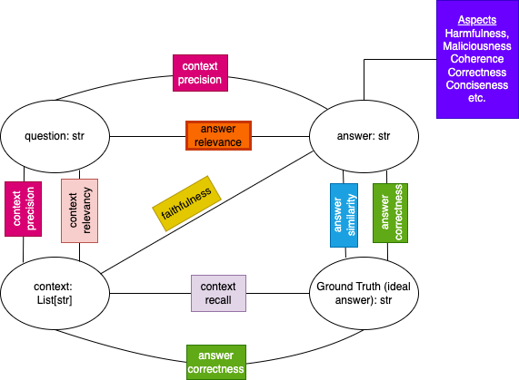

# llm-rag-eval

Large Language Model (LLM) powered evaluator for Retrieval Augmented Generation (RAG) pipelines.



## Google AI Hackathon Submission

### Inspiration

The project is inspired by the [RAGAS project](https://github.com/explodinggradients/ragas) which provides various prompt based approaches to compute various metrics to evaluate a RAG pipeline, and by ideas in the [ARES paper](https://arxiv.org/abs/2311.09476), which attempts to calibrate these LLM evaluators against human evaluators.

### What it does

It provides implementations of metrics that can be applied to outputs of a RAG pipeline in a zero-shot manner, and provides functionality to fine-tune models to generate these metrics targeted to one's use case using small amounts of human annotations.

### How we built it

We used the [DSPy](https://github.com/stanfordnlp/dspy) framework from the ground up to replicate the metrics provided by RAGAS, then extended these metrics to allow for fine-tuning small models using small amounts of human generated evaluations.

### Challenges we ran into

TBD

### Accomplishments that we're proud of

TBD

### What we learned

TBD

### What's next for llm-rag-eval

TBD

## Running RAGAS metrics

You can run all the RAGAS metrics against your dataset by calling the `run_prompted_metrics.py` script in the `src` directory, with the path to the input (provided in JSON-L), the path to the output (TSV) file, and the appropriate metric name.

```
$ python3 run_prompted_metrics.py --help
usage: run_prompted_metrics.py [-h] --metric
                               {answer_correctness,answer_relevance,answer_similarity,context_precision,context_recall,context_relevance,context_utilization,faithfulness}
                               --input-jsonl INPUT_JSONL [--output-tsv OUTPUT_TSV] [--parallel] [--cross-encoder]

options:
  -h, --help            show this help message and exit
  --metric {answer_correctness,answer_relevance,answer_similarity,context_precision,context_recall,context_relevance,context_utilization,faithfulness}
                        The metric to compute
  --input-jsonl INPUT_JSONL
                        Full path to evaluation data in JSONL format
  --output-tsv OUTPUT_TSV
                        Full path to output TSV file
  --parallel            Run in parallel where possible (default false)
  --cross-encoder       Use cross-encoder similarity scoring (default false)
```

Ideally, we want to generate metrics from a running RAG pipeline, but in order to simplify the development process, we have isolate the evaluation functionality, feeding it the input it needs via a JSON-L file. Each line of the JSON-L file represents a single RAG transaction. The required fields are as follows:

```
{
    "id": {qid: int},
    "query": {query: str},
    "context": [
        {
            "id": {chunk_id: str},
            "chunk_text": {chunk_text: str},
            ... other relevant fields
        },
        ... more context elements
    ],
    "ideal_answer": {ground_truth: str},
    "predicted_answer": {answer: str}
}
```
